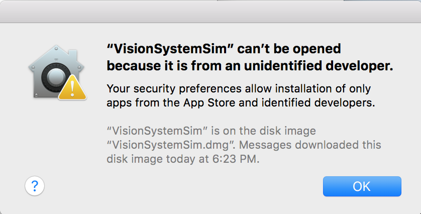
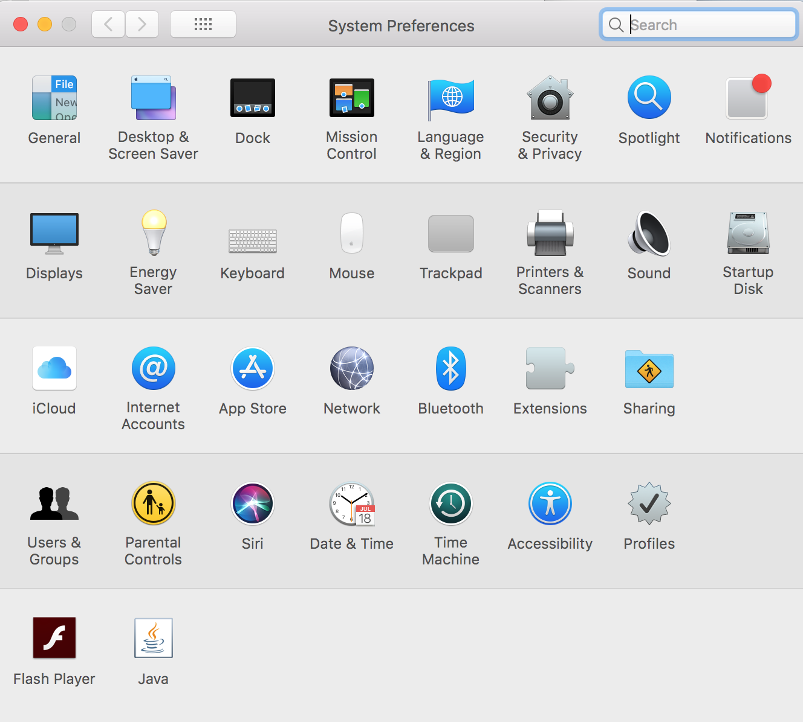
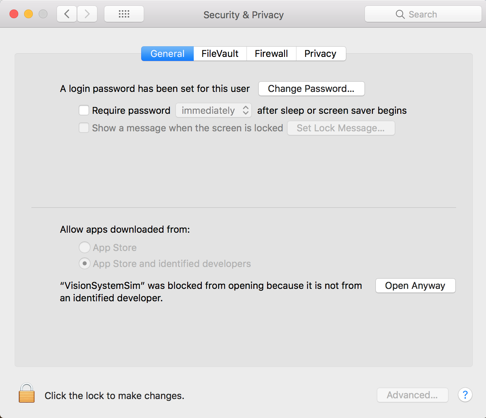

# VisionSystemSimulator

The Vision System Simulator is a tool that will provide students with an avenue to test navigation code without having access to a physical tank. The program communicates with a physical arduino board over USB to execute the navigation program uploaded on the arduino board. It is designed to mimic the API used for RF and tank communication which will be used later on in the course. It is also designed to current mission specifications, ensuring that the navigation code will be executed on relevant randomizations. The OSV in the simulation is designed to move and look like the tanks provided by the course for testing. 

NOTE: This simulator is provided as a convinence. Even though your code may work on the simulator, that does not nessesarily imply that the code will work on an actual OSV.

## Table of Contents
- [Installation instructions](#installation-instructions)
- [Using the Simulator](#using-the-simulator)
- [Simulator Arduino Library](#simulator-arduino-library)
- [Moving off the Simulator](#enes100simulation-object)

## Installation instructions

### Additional Requirements

In addition to the simulator application, you will also need:
1. The Arduino IDE, available [here](https://www.arduino.cc/en/Main/Software#download). Follow the instructions on the website to download the IDE.
2. The Arduino Library that interfaces with the simulator. You will use this library to control the simulated OSV. It comes with an example sketch to get you started. To download the library, go to [this Github repository](https://github.com/umdenes100/SimulatorArduinoLibrary) and click on the green button that says 'Clone or Download', then click 'Download ZIP'.  Open the Arduino IDE and install the library by going to Sketch > Include Library > Add .ZIP Library and selecting the downloaded file.
3. An Arduino board and USB cable. Your instructor will provide these materials to you.

### Youtube Video explaining download and installation instructions
This video shows how to download and install the simulator. The steps are also outlined below. Click on the thumbnail to be redirected to the Youtube video, or follow the steps listed below the thumbnail.

### Windows Download and Installation Instructions

The VisionSystemSimulator is compatible with Windows 8 and Windows 10. It has not been tested for Windows 7 or previous versions.

To download the VisionSystemSimulator for Windows, first go to [this webpage](https://github.com/umdenes100/VisionSystemSimulatorInstallers/blob/master/VisionSystemSimInstaller.exe). Then click on the "Download" button.

Once VisionSystemSimulator.exe has finished downloading, double click on it to run the installer. If a security warning pops up, click "More Info" and then "Run Anyways". This will open the installer window. Click through the installer, then click finish. 

The Simulator is now installed on your computer. You can run the application by searching for it and then double clicking on it to run the application. 

### MacOS Download and Installation Instructions

The VisionSystemSimulator is built to work on any MacOS 10.5 and onward.

To download this Installer onto your Mac, begin by double clicking the VisionSystemSim.dmg file. This will open a new window, continue by double clicking on the application. 

Note: Sometimes a security warning will appear prompting further attention. So resolve this follow the steps below.

Security Warning Message:

Step 1) Open the general settings window.

General Settings Window:

Step 2) Click onto the "Security & Privacy" icon.

Step 3) In the window below click on the "Open Anyways" Icon if available. If this option is not available change the setting options located at the bottom of the window.

Security Options Window:

## Using the simulator

### Getting Started
Follow these steps to run the example sketch on the simulator: 
1. First, you will need to upload navigation code to the Arduino board. To upload the example sketch, open the Arduino IDE and go to File > Examples > DFRTankSimulation > navigation_example
2. Now, upload the sketch to the Arduino board. Your instructor or TA will show you how to do this in class.
3. Open the simulator by locating it in your computer and double clicking it. It should be in your start menu, but you can also locate it by searching for 'VisionSystemSim'
4. Once the simulator is open, enable all of the distance sensors that your code will be using by opening the 'Edit OSV' window and clicking on each sensor referenced in the example code (the example sketch only uses sensor 1, but you can use more in your navigation code) to toggle it on.
5. If you want to edit the length and width of the OSV, you can do that in the OSV window by dragging the sliders up or down. 
6. Click on 'Select Port' and then click on the port the Arduino is connected to.

### Rerunning the simulation with the same code
If you want to re-run the navigation, follow these steps:
1. Click the 'Clear' button next to the 'Select Port' box to disconnect the Arduino from the Simulator. 
2. Reset the Arduino by clicking the reset button on the board or by unplugging and replugging the cable. 
3. Click 'Reset' to move the OSV back to it's starting location, or click 'Randomize' to reset the OSV and generate a new obstacle randomization.
4. Click on 'Select Port' and then click on the port the Arduino is connected to.

### Rerunning the simulation with new code
If you want to re-run the navigation, follow these steps:
1. Click the 'Clear' button next to the 'Select Port' box to disconnect the Arduino from the Simulator. 
2. Upload the new navigation sketch from the Arduino IDE
3. Click 'Reset' to move the OSV back to it's starting location, or click 'Randomize' to reset the OSV and generate a new obstacle randomization.
4. Click on 'Select Port' and then click on the port the Arduino is connected to.

### Simulation Options
- **Obstacles** - The obstacles can be enabled or disabled on the left side by selecting 'on' or 'off'
- **Communication** - The communcation can be changed by selecting 'ideal' or 'realistic'
	- **Ideal** - Ideal communication means the Arduino and the simulator communicate as fast as possible (about 30ms) when `Enes100Simulation.updateLocation()` is called.
	- **Realistic** - Realistic communication means the simulator will attempt to model as closely as possible how OSV's communicate with the actual Vision System. `Enes100Simulation.updateLocation()` will take 140ms on average, and will fail sometimes. 

## Simulator Arduino Library

### DFRTankSimulation Object

The functions associated with the DFRTankSimulation object control the movement of the OSV. 

`void turnOffMotors()`
This function simply stops the OSV by setting both motor PWM's to zero.

`void setRightMotorPWM()`
This function sets the PWM of the tank's right motor. It accepts one argument (an integer), which should be in the range [-255, 255]

`void setLeftMotorPWM()`
This function sets the PWM of the tank's left motor. It accepts one argument (an integer), which should be in the range [-255, 255]

### Enes100Simulation Object

The functions associated with the Enes100Simulation object provide information about the OSV's location, destination, and distance sensor readings. They also allow print messages to be sent to the console for debugging purposes. 

`bool retrieveDestination()`
This function retrieves the destination for the current run from the simulator, stores the destination in the destination variable, and returns true or false depending on the success of the call. This function should be encapsulated in a while loop to ensure that the OSV has retrieved the destination before begining the run.

`bool updateLocation()`
This function communicates with the simulator to retrieve the current OSV location and updates the location variable in the object. It returns true or false depending on the success of the call.

`float readDistanceSensor(int sensorIndex)`
This function reads the distance sensor on the simulator OSV and returns the distance as a float. The sensor index is a number from 0-11 as defined in the simulator 'Edit OSV' form.

`void print(msg), void println(msg)`
These functions are print messages to the console. These functions may be helping in debugging your code. 

## Moving off of the simulator
If you wish to take your simulator code and move it onto the physical tanks, there are a few basic steps to follow:
1. Replace all instances of DFRTankSimulation and Enes100Simulation in your code with DFRTank and Enes100 respectively.
2. Locate the line in which you create the Enes100 object and add the appropriate arguments. For more information on how to do this follow [this](https://github.com/umdenes100/Enes100ArduinoLibrary) link.
3. re-implement the distance sensor function on your own.

Once you have completed these steps, you should be able to upload your navigation code to a physical tank. 

WARNING: Even though your code may work on the simulator, that does not nessesarily guarantee that it will work in real life. The simulator is meant to serve as a tool to assist in the programming process and is not 100% indicative of real life conditions. To ensure that your code will work on your osv, you will need to test in the real world.
