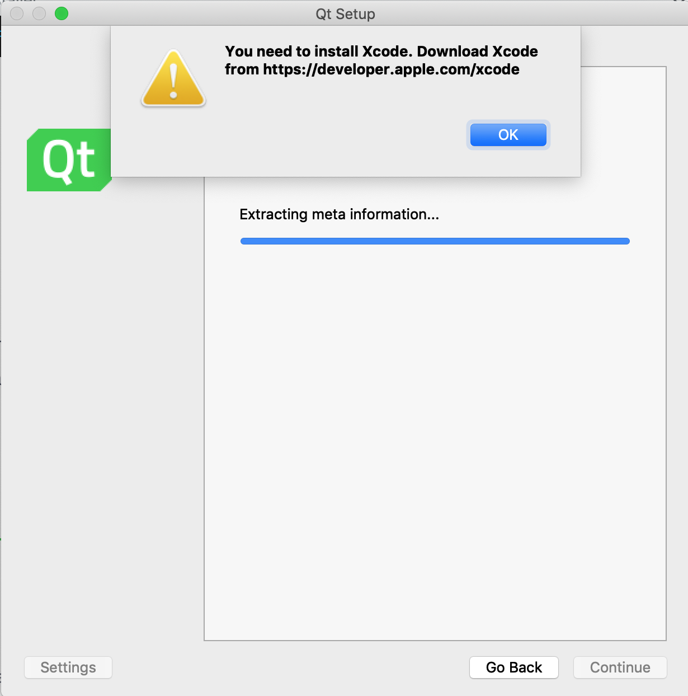

# Building a Qt Application for Mac

If you're reading this, you're either a current LTF who has been assigned this miserable task, or a prospective LTF who is scouring  the GitHub repository in search of the activities you might be subjected to upon being hired.

If you're in the former category, you're already doomed. 

If you're in the latter category, I understand that things might look bleak, but you should know that this is really the worst this job gets. In the event that you do get hired, I recommend a few strategies - 

If you have a Macintosh computer, get rid of your Macintosh computer. While they are excellent devices, it means that you're now a target for this very activity. 

I recommend two alternatives - the first is to purchase a Windows machine and develop the grit that can only come of your kind being considered inferior, and being unsupported by every library under the Sun. The second is to purchase a cheap Lenovo computer, install some kind of complicated Linux distro - Arch Linux or Gentoo come to mind (turtleneck and tortoise-shell glasses sold separately), and then go use Windows in the library. These will both provide sufficient hipster programmer cred and more importantly, will save you from the plight of building Qt applications for Mac.

So why is building a Qt application for Macintosh so complicated? Well, the general answer is that the biggest problem a Mac developer suffers from is the 'not quite Linux' problem. You see, if you're developing cross-platform, you know you're going to need to hire some full time .NET developers to port native to Windows. You resign yourself to that fate and get the job done pretty well. However, when it comes to Macs, you simply shrug, utter the phrase "Eh Macs are UNIX it'll probably work fine" and cast the blasted activity aside entirely.

As a result, there are installation and dependency issues that I could probably solve in a relatively small amount of time if I didn't waste it writing flowery documentation that nobody was ever going to read.

Alas, let's begin.

## Pre-requsities

It might not come up in this installation, but useful enough to have (especially for when this guide goes out of date).

### Git

This is going to be an LTF staple, so make sure it's installed and functioning on your machine. You can find the installation [here.](https://git-scm.com/download/mac)

### VisionSystemSim

Clone the repo by running - 

```bash
git clone https://github.com/umdenes100/VisionSystemSim.git
```

Alternatively, you can simply download and unzip [the zip file found here.](https://github.com/umdenes100/VisionSystemSim/archive/master.zip)

### Brew

```bash
/usr/bin/ruby -e "$(curl -fsSL https://raw.githubusercontent.com/Homebrew/install/master/install)"
```

### Qt + QtCreator

There are several ways to install Qt. You might be tempted to install it from the command line, but I'd recommend using the GUI. The main reason for this is when you install from the command line, you install Qt and QtCreator separately. Linking the two ends up becoming a damned nuisance.

I'm going to be installing Qt from [this website](https://www.qt.io/download-qt-installer). The latest version is usually not a bad bet, but in case stuff starts going pear shaped, just default to the version I'm using - 5.12.1. It's a relatively straightforward installation process. Except for one hitch...



This thing is a real kick in the pants when you first see it, but it's easy enough to fix. The Qt installer is a real pushover. If you simply click 'OK' a bunch of times, it'll switch out its prompt in the hope of winning you over with a lesser demand, and then eventually give in. (It should be noted that it's a *bunch* of times. About 20...)

Now, the next step is important. It's going to ask you to select an installation location. Make sure you remember this. I'm going to use the default directory - 

`/Users/<USERNAME>/Qt`. I will refer to whatever installation location you choose as QT_DIRECTORY. This will come up again later in the installation.

## Verifying that the Simulator Works

Libraries are complicated and there's a non-trivial chance that the simulator that worked on one person's computer won't work on yours. Verifying this will save you plenty of time in the long run. Once your installation is complete, open QtCreator.

Open a new project and click on the .pro file found the VisionSystemSim folder.

Click 'Configure Project' and give it a second. Once you're done, click on the big Play button on the bottom left. If everything builds and runs with no error, then you're ready to move onto the next step.

## Deploying the Application for Mac

To deploy a Qt Application for Mac, you need a tool called `macdeployqt`. This comes pre-installed with Qt, but isn't correctly added to path, which means that running `which macdeployqt` or simply `macdeployqt` will either fail and give you the wrong copy of `macdeployqt`.

The path to `macdeployqt` will be based in QT_DIRECTORY. It goes as follows - 

`<QT_DIRECTORY>/<VERSION_NUMBER>/clang_64/bin/macdeployqt`

For example, where my username is ExSidius and version number is 5.12.1, the path looks like this - 

`/Users/ExSidius/Qt/5.12.1/clang_64/bin/macdeployqt`

Now, go back to QtCreator, click on the `Projects` tab on the left (with the spanner icon above it) and go to the specified build directory. You can do this with the `cd` command.

e.g.
```bash
cd /Users/ExSidius/Dropbox/actual-code/VisionSystem/build-VisionSystemSim-Desktop_Qt_5_12_1_clang_64bit-Debug
```

Once you're in the right folder, create the installer by running the following command.

```bash
<QT_DIRECTORY>/<VERSION_NUMBER>/clang_64/bin/macdeployqt VisionSystemSim.app -dmg
```

The -dmg flag specifies the kind of compression we want to use. It's just like compressing into a .zip, .tar, or .exe file, except convenient and fast for Macs.

Once that's done, you should see a file titled `VisionSystemSim.dmg` in the directory. This is your installer. Replace the installer in this repo with the one you've just created.

Then - 

```bash
git add .
git commit -m "New Mac Release"
git push
```

And you should be good to go!
